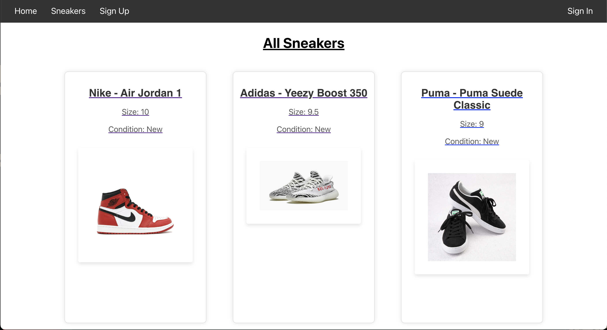

# Sneaker World

Sneaker World is an online sneaker database that enables users to share the latest footwear releases, leave reviews, and make informed purchasing decisions. The application features a React front end and a Ruby on Rails back end, incorporating bcrypt for secure password handling and ActiveRecord for database management.

## Features

- **User Authentication:**
  - Users can create accounts with a secure password, username, email, and profile photo.
  - Secure password storage using bcrypt ensures user data is protected.

- **Sneaker Management:**
  - Logged-in users can add sneakers to the database.
  - Users can edit only the sneakers they added to the database.
  - Deletion of sneakers is restricted to the user who added them.

- **Review System:**
  - Users can leave reviews on individual sneakers.
  - Edit functionality is limited to the reviews left by the logged-in user.
  - Deletion of reviews is restricted to the user who left them.

- **Profile Management:**
  - Users can update their profiles by changing their username, email, and profile photo URL.

## Technology Stack

- **Frontend:**
  - React: A JavaScript library for building user interfaces.

- **Backend:**
  - Ruby on Rails: A web application framework written in Ruby.
  - ActiveRecord: An Object-Relational Mapping (ORM) system for interacting with the database.
  - Bcrypt: A password hashing algorithm for secure password storage.

## Database Models

### User

- Attributes:
  - `id`: Primary key
  - `username`: Unique username for the user.
  - `email`: Email address of the user.
  - `password_digest`: Hashed password for secure storage.
  - `profile_photo_url`: URL of the user's profile photo.

### Reviews

- Attributes:
  - `id`: Primary key
  - `user_id`: Foreign key linking to the user who left the review.
  - `sneaker_id`: Foreign key linking to the sneaker being reviewed.
  - `content`: Text content of the review.

### Sneakers

- Attributes:
  - `id`: Primary key
  - `user_id`: Foreign key linking to the user who added the sneaker.
  - `brand`: Brand of the sneaker.
  - `model`: Model name of the sneaker.
  - `size`: Size of the sneaker.
  - `condition`: Condition of the sneaker.
  - `retail_price`: Retail price of the sneaker.
  - `photo_url`: URL of the photo for the sneaker.

## Screenshots





## Video Walkthrough

[](https://youtu.be/UntYcb3ev58)


## Getting Started

1. **Clone the Repository:**
   ```bash
   git clone https://github.com/jakebroffman/phase-4-project.git

2. **Install Dependencies:**
    cd phase-4-project
    npm install     # Install frontend dependencies
    bundle install  # Install backend dependencies

3. **Database Setup:**
    rails db:create   # Create the database
    rails db:migrate  # Run migrations

4. **Run The Application:**
    npm start   # Start the React frontend
    rails s     # Start the Ruby on Rails backend

4. **Access The Application:**
    Open your browser and navigate to http://localhost:3000 to access Sneaker World.


    


    


